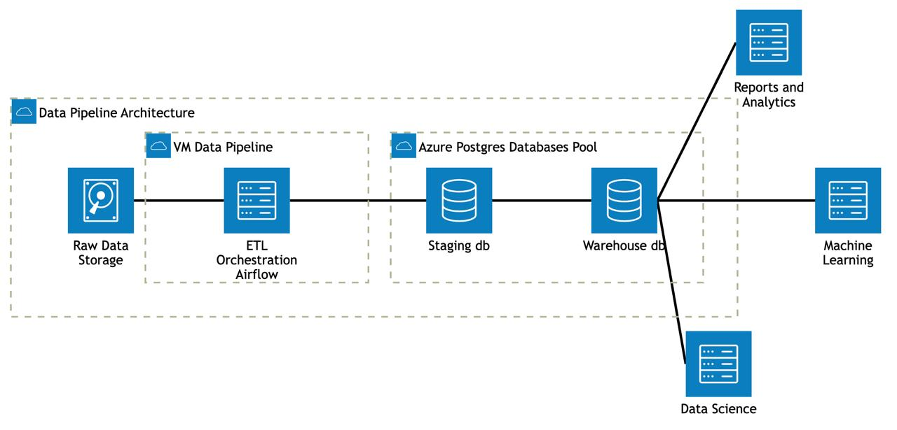

# Data Pipeline from CSV to Postgres using DBT Transformation

## Table of Contents

1. [Overview](#overview)
2. [Data Architecture](#data-architecture)
3. [Structure](#structure)
4. [Components](#components)
5. [Data Pipeline Overview](#data-pipeline-overview)
6. [Workflow](#workflow)
7. [Setup and Execution](#setup-and-execution)
   1. [Prerequisites](#prerequisites)
   2. [Steps](#steps)
8. [Conclusion](#conclusion)

## Overview

The objective of this project is to build an end-to-end ETL (Extract, Transform, Load) pipeline that ingests transactional data from multiple sources, transforms it into meaningful datasets, and stores it in a PostgreSQL data warehouse. The pipeline leverages modern tools like Apache Airflow for orchestration, dbt for data transformations, and Docker for environment isolation.

## Data Architecture



- Raw Data Storage:
Hourly CSV files are uploaded to Azure Blob Storage as the raw data landing zone.
- VM Data Pipeline:
   - Apache Airflow, hosted in a Docker VM on Azure, orchestrates the ingestion of data from Blob Storage into Azure PostgreSQL (staging schema).
   - dbt, hosted in another Docker VM, processes raw data from the staging schema in Azure PostgreSQL to create fact and dimension tables in the warehouse schema.
- Azure Postgres Database Pool:
Azure PostgreSQL stores raw data in the staging schema and transformed data in the warehouse schema.
- Report and Analytics | Machine Learning | Data Science:
Azure Power BI accesses the warehouse schema in Azure PostgreSQL for analytics and reporting.

## Structure

```markdown
project/
├── airflow/
│   ├── dags/
│   │   ├── scripts/
│   │   │   ├── load_delta_data.py    # Script to load delta data to staging
│   │   ├── etl_pipeline.py           # DAG for pipeline orchestration
│   ├── logs/                         # Airflow runtime logs
│   ├── output/                       # Airflow Pipeline output
│   ├── .env                          # Airflow Docker environment file
│   ├── Dockerfile                    # Dockerfile for Airflow
├── dbt/
│   ├── models/
│   │   ├── staging/                  # DBT Staging data transformation
│   │   │   ├── staging_categories.sql 
│   │   │   ├── staging_goods.sql      
│   │   │   ├── staging_orders.sql     
│   │   │   ├── staging_order_item.sql 
│   │   │   ├── staging_users.sql      
│   │   ├── warehouse/                # DBT Data Warehouse transformation
│   │   │   ├── fact_transactions.sql 
│   │   │   ├── dim_users.sql          
│   │   │   ├── dim_goods.sql          
│   ├── logs/                         # DBT runtime logs
│   ├── target/                       # DBT compilation output file
│   ├── dbt_project.yml               # DBT project configuration
│   ├── profiles.yml                  # DBT connection profiles
├── postgres/
│   ├── initdb.sql                    # Initialize database schema and tables
├── docker-compose.yml                # Docker-compose configuration for all services
├── README.md                         # Project documentation
```

## Components

1. Apache Airflow
- Purpose: Orchestrates the entire ETL pipeline, automating tasks such as data ingestion, transformation, and load scheduling.
- Features:
    - Incremental data ingestion based on timestamps.
    - DAGs (Directed Acyclic Graphs) for clear task dependencies.
    - Scalability for complex workflows.

2. dbt (Data Build Tool)
- Purpose: Handles data modeling and transformation within the PostgreSQL data warehouse.
- Features:
    - Transformations for both staging and warehouse layers.
    - SQL-based configurations.
    - Version control for data models.

3. PostgreSQL
- Purpose: Serves as the data warehouse to store both raw (staging) and transformed data (warehouse).
- Features:
    - Reliable and robust relational database.
    - Structured schema for both staging and dimensional modeling.

4. Docker
- Purpose: Provides isolated and reproducible environments for all components.
- Features:
    - Containers for Airflow, dbt, and PostgreSQL.
    - Simplified deployment with Docker Compose.

## Data Pipeline Overview

1. Flow Data Pipeline
- Extract:
    - Transactional data is provided as hourly CSV files.
    - Data is ingested into staging tables in PostgreSQL.
- Transform:
    - Raw data is processed using dbt to create fact and dimension tables.
    - Examples:
        - `fact_transactions`: Captures detailed transaction-level data.
        - `dim_users`: Provides user-level aggregations, such as the last transaction timestamp.
- Load:
    - Transformed data is loaded into the warehouse schema for analytics and reporting.

2. Components Interaction
    - Airflow DAGs orchestrate the data flow:
    - Incremental ingestion from source to staging.
    - Execution of dbt transformations.
    - PostgreSQL stores both raw and transformed data.
    - dbt manages SQL models for data transformations.
    - Docker Compose coordinates the execution environment.


## Workflow

1. Flow Data Pipeline
- Extract:
    - Transactional data is provided as hourly CSV files.
    - Data is ingested into staging tables in PostgreSQL.
- Transform:
    - Raw data is processed using dbt to create fact and dimension tables.
    - Examples:
        - `fact_transactions`: Captures detailed transaction-level data.
        - `dim_users`: Provides user-level aggregations, such as the last transaction timestamp.
- Load:
    - Transformed data is loaded into the warehouse schema for analytics and reporting.

2. Components Interaction
- Airflow DAGs orchestrate the data flow:
    - Incremental ingestion from source to staging.
    - Execution of dbt transformations.
- PostgreSQL stores both raw and transformed data.
- dbt manages SQL models for data transformations.
- Docker Compose coordinates the execution environment.


## Setup and Execution

### Prerequisites
- Docker and Docker Compose installed.
- Source Data CSV files.

### Steps

1. Clone the repository.
2. Navigate to the project directory.
3. Run the following command to start the services:
```bash
docker-compose up --build
```
4. Access services:
    - Airflow UI: http://localhost:8080
    - PostgreSQL: Connect via a database client using port 5432.
5. Trigger the Airflow DAG to start the pipeline.
6. Verify transformed data in the PostgreSQL warehouse.

## Conclusion
This project demonstrates a scalable and efficient ETL pipeline leveraging industry-standard tools. It ensures a structured, reliable, and automated approach to data warehousing and transformation, providing a solid foundation for analytics and data-driven decision-making.
